# Frontier Pulse - Technical Architecture Document

This document provides a comprehensive, deep-dive specification of the production-grade architecture of **Frontier Pulse**. It details the design patterns, component interactions, data schemas, and infrastructure configurations of the system.

---

## 1. System Architecture Overview

Frontier Pulse is a self-contained AI-powered technical publishing pipeline. It is engineered to operate seamlessly across two execution paradigms:
1. **Local CLI Development:** Runs on local state manifests and directories, using Google Cloud Application Default Credentials (ADC) for Text-to-Speech.
2. **Serverless Cloud Engine:** Operates on stateless Google Cloud Run Functions (Gen 2), utilizing Google Cloud Storage (GCS) as a transactional state layer, Secret Manager for securely mounting credentials, and Cloud Scheduler for time-zone aligned triggering.

### End-to-End Execution Flow

```mermaid
flowchart TD
    subgraph Trigger & Event Layer
        Cron[Cloud Scheduler <br> Mondays 17:00 Bogotá] -->|Secure OIDC Request| HTTPS[Cloud Run Functions Gen 2 <br> HTTP Entrypoint]
    end

    subgraph State & Sync Layer
        GCS[(GCS Bucket <br> gs://frontier-pulse-data)]
        HTTPS -->|Sync-on-Start| LocalTmp[(In-Memory /tmp/)]
        LocalTmp <-->|State Transactions| Manifest[EditionManifest]
    end

    subgraph Core Pipeline Execution
        LocalTmp -->|Phase 1: Discover| Research[AI Web Research & Grounding]
        Research -->|Phase 1.5: Gate| Quality[Editorial Quality Gate]
        Quality -->|Phase 2: Script| Script[Phonetic Normalization & Scripting]
        Script -->|Phase 3: Synthesize| TTS[Google Cloud Text-to-Speech]
        Quality -->|Phase 3.5: Image| Cover[Nano Banana Cover Art Gen]
        TTS & Cover -->|Phase 4: Deliver| Telegram[Idempotent Telegram Publisher]
    end

    subgraph Persistence Layer
        Telegram -->|Success Status| SyncSuccess[Sync-on-Success]
        SyncSuccess -->|Atomic Recursive Upload| GCS
    end
    
    style GCS fill:#1a365d,stroke:#3b82f6,stroke-width:2px;
    style LocalTmp fill:#2d3748,stroke:#a0aec0,stroke-dasharray: 5 5;
```



---

## 2. Component Design & Implementation

### 2.1. Dynamic Web Research & Deduplication (`ia_news_researcher.py`)
- **Query Grounding:** Rather than raw language generation, this module utilizes Google Gemini's **Google Search Tool Grounding** (`google-genai` SDK) to dynamically perform live web queries across nine pre-configured priority AI topics (e.g., Company Brain, Project Astra, Claude, OpenAI, Governance).
- **Bogotá Aligned Time Windows:** Execution is bounded deterministically using Bogotá local time (`America/Bogota` timezone, UTC-5). The research window spans from Monday `00:00:00` (previous week) to Monday `23:59:59` (execution day), closing the "empty Monday gap" cleanly.
- **Historical Deduplication:** The module ingests the last 4 weeks of weekly news JSON reports. It extracts and hashes past article titles, IDs, and URLs to construct a deduplication dictionary. Any live article whose titles or URLs have a cosine similarity or exact-match signature in past reports is filtered out to ensure freshness.

### 2.2. Editorial Quality Gate (`quality_gate.py`)
To prevent hallucinated, outdated, or low-value topics from proceeding to synthesis, an automated **Quality Gate** reviews every discovered article:
- **Topic Relevance Check:** Discard articles whose main themes drift outside the nine priority AI domains.
- **Link & Citation Integrity:** Performs format checking and basic status checks to ensure that sources have valid domain roots.
- **Temporal Check:** Discards any article whose published date falls outside the computed Bogotá-aligned target week.

### 2.3. Transcripts & Analytical Script Normalization (`script_generator.py`)
Synthesizing natural, engaging, and professional spoken voice requires transforming raw text elements into structured broadcast monologues with phonetic normalization:
- **7-Step Monologue Structure:** Follows an analytical arc designed for tech-savvy listeners:
  1. *Opening Hook:* High-impact framing of the development as strategic or surprising.
  2. *Main Announcement:* Clear articulation of the core news item.
  3. *Technical Performance & Benchmarks:* Specific metrics, dates, percentages, and prices.
  4. *Competitor Comparisons:* Analysis against competing frontier lab models and products.
  5. *Business & Strategic Implications:* Strategic impact on developers, markets, and enterprise.
  6. *Broader Industry Trend:* Placing the announcement into larger industry movements.
  7. *Concise Conclusion & Audience Question:* Thought-provoking closing query.
- **Phonetic Translations:** Translates technical acronyms into spoken words (e.g., `TTS` $\rightarrow$ `té té ese`, `AI` $\rightarrow$ `inteligencia artificial`, `LLM` $\rightarrow$ `ele ele eme`).
- **Numerical Expansion:** Converts figures, percentages, dates, and version numbering into explicit Spanish grammar strings (e.g., `v2.5` $\rightarrow$ `versión dos punto cinco`, `15%` $\rightarrow$ `quince por ciento`, `2026` $\rightarrow$ `dos mil veintiséis`).
- **Dual Transcripts:** Co-generates a Latin American Spanish broadcast script (`podcast_script_es.txt`) and an English written record transcript (`podcast_script_en.txt`) for dual-language accessibility.

### 2.4. Podcast Cover Art Generation (`image_generator.py`)
Every episode features custom visual cover art designed from the week's top stories:
- **Metaphor Synthesis:** Gemini (`gemini-3.7-flash`) reviews the week's chosen news stories and extracts visual themes and metaphors across three creative variables: `central_visual_element`, `news_visual_symbols`, and `color_palette`.
- **Multimodal Generation:** Leverages Gemini multimodal image generation (`gemini-3.1-flash-image` with `response_modalities=["IMAGE"]`) and Imagen fallback mechanisms.
- **Vertical Ratio:** Renders vertical `9:16` posters optimized for podcast and social media display.

### 2.5. High-Definition Spoken Audio Synthesis (`audio_generator.py`)
- **Voice Engine:** Directly interfaces with Google Cloud Text-to-Speech via the native Python client SDK.
- **HD Voice Configuration:** Employs the Latin American Spanish voice **`es-US-Chirp-HD-O`** for broadcast realism.
- **Sentence-Boundary Chunking:** Intelligently partitions long scripts into natural sentence-level chunks ($\le 4000$ bytes) before API submission, seamlessly concatenating audio bytes to avoid Google Cloud TTS payload size limits.
- **Portability:** Handles audio synthesis and MP3 assembly purely in Python without requiring external system dependencies like `ffmpeg`.

### 2.6. Idempotent Telegram Publisher (`telegram_publisher.py`)
- **Atomic Delivery State:** Employs a granular State Machine tracking the delivery state of separate media assets (`text_delivered`, `image_delivered`, and `audio_delivered`).
- **Escaping & Formatting:** Features robust Markdown character escaping, avoiding message breaks from unsupported symbols.
- **Multipart Media Transmissions:** Delivers the formatted summary message, vertical cover poster, and final `.mp3` episode to the designated Telegram chat/channel with automatic retry and atomic manifest checkpoints.

---

## 3. Data Schema & Transaction Specifications

Every edition's state is managed through a strictly validated schema implemented using **Pydantic v2**:

```
                  ┌──────────────────────┐
                  │    EditionManifest   │ (edition_date, status, artifacts)
                  └──────────┬───────────┘
                             │
            ┌────────────────┴────────────────┐
            ▼                                 ▼
   ┌─────────────────┐               ┌─────────────────┐
   │  DeliveryState  │               │ DiscoveryEdition│
   │ (text_delivered,│               │ (items: list of │
   │  image_delivered,               │  NewsItem)      │
   │  audio_delivered)               └─────────────────┘
   └─────────────────┘
```

### 3.1. `EditionManifest` Schema (`src/schemas.py`)
Tracks the complete lifecycle of a single weekly episode. This manifest is saved atomically after each stage:
- **`edition_date`** (string, `YYYY-MM-DD`): The target Monday date.
- **`status`** (string): Current pipeline stage (`created`, `researched`, `scripted`, `audio_ready`, `delivered`, `failed`).
- **`artifacts`** (dict): Key-value mappings of absolute paths to created files (scripts, audio, images).
- **`delivery_state`** (`DeliveryState` model): Captures exact Telegram delivery status and message IDs.
- **`last_successful_stage`** (string): Backtrack reference to safely resume a failed pipeline.
- **`error_message`** (string): Details of execution exceptions if they occur.

---

## 4. Cloud Infrastructure Design

### 4.1. Bidirectional Local-to-Cloud Storage Sync (`src/gcs_sync.py`)
To keep the Cloud Function serverless and stateless while maintaining state persistence across runs:
- **Sync-on-Start:**
  - Recursively downloads historical reports from the GCS bucket `gs://<bucket>/output/history/` to `/tmp/output/history/` to enable deduplication.
  - Downloads any existing `manifest.json` for the current date from `gs://<bucket>/output/editions/<date>/` to `/tmp/output/editions/<date>/` to enable checkpoint-resumptions.
- **Sync-on-Success:**
  - Upon successful execution, recursively scans `/tmp/output/` and uploads all generated assets (scripts, MP3, cover JPG, manifest, quality report) back to GCS, maintaining a versioned folder hierarchy.

### 4.2. Ingress & OIDC Authentication
- **Secure Ingress:** The function is deployed with `--no-allow-unauthenticated` and `--ingress-settings=all`, enabling Cloud Scheduler to deliver authenticated POST requests across Google's routing network.
- **OIDC Token Authorization:** Cloud Scheduler passes a cryptographically signed OIDC token matching the `frontier-pulse-invoker` service account (`roles/run.invoker`), ensuring zero unauthorized access.

### 4.3. Secure Identity Strategy (SAs & IAM)
Frontier Pulse does not use the high-privilege Default Compute Engine Service Account. It segregates tasks across two custom service accounts:

| Service Account | Role Name | Scope / Permissions granted | Purpose |
| :--- | :--- | :--- | :--- |
| **`frontier-pulse-runner`** | Custom Runner SA | `roles/storage.objectAdmin` (on bucket), <br>`roles/secretmanager.secretAccessor` (on secrets), <br>`roles/logging.logWriter` (Cloud Logging) | Runs container execution, synthesizes Text-to-Speech, accesses Secret Manager secrets, and synchronizes GCS state. |
| **`frontier-pulse-invoker`** | Custom Invoker SA | `roles/run.invoker` (granted on the Cloud Run function) | Authorized to trigger the internal HTTP endpoint. Used by Cloud Scheduler. |
| **`Default Build SA`** | - | `roles/cloudbuild.builds.builder` (Self-healed during deploy) | Used by Cloud Build to assemble the function. |

---

## 5. Security & Credentials Strategy

- **Google Gemini Developer API Key (`GEMINI_API_KEY`):** LLM research, script synthesis, and cover art generation authenticate directly using `GEMINI_API_KEY`.
- **GCP Services Authentication:** Text-to-Speech synthesis and Cloud Storage sync authenticate using Google Application Default Credentials (ADC) locally and the custom Runner Service Account in Cloud Run Functions.
- **Zero-Hardcoded Secrets:** No keys are committed. Credentials (`GEMINI_API_KEY`, `TELEGRAM_BOT_TOKEN`, and `TELEGRAM_CHAT_ID`) are managed via **Secret Manager**.
- **Environmental Mounts:** Secret Manager secrets are mounted directly as environment variables in the Cloud Run Function runtime, preventing secrets from leaking into container filesystems or build logs.
