# Frontier Pulse - Technical Architecture Document

This document provides a comprehensive, deep-dive specification of the production-grade architecture of **Frontier Pulse**. It details the design patterns, component interactions, data schemas, and infrastructure configurations of the system.

---

## 1. System Architecture Overview

Frontier Pulse is a self-contained AI-powered technical publishing pipeline. It is engineered to operate seamlessly across two execution paradigms:
1. **Local CLI Development:** Runs on local state manifests and directories, using Google Cloud Application Default Credentials (ADC) for Text-to-Speech.
2. **Serverless Cloud Engine:** Operates on stateless Google Cloud Run Functions (Gen 2), utilizing Google Cloud Storage (GCS) as a transactional state layer, Secret Manager for securely mounting credentials, and Cloud Scheduler for time-zone aligned triggering.

### End-to-End Execution Flow

```mermaid
flowchart TD
    subgraph Trigger & Event Layer
        Cron[Cloud Scheduler <br> Mondays 17:00 Bogotá] -->|Secure OIDC Request| HTTPS[Cloud Run Functions Gen 2 <br> HTTP Entrypoint]
    end

    subgraph State & Sync Layer
        GCS[(GCS Bucket <br> gs://frontier-pulse-data)]
        HTTPS -->|Sync-on-Start| LocalTmp[(In-Memory /tmp/)]
        LocalTmp <-->|State Transactions| Manifest[EditionManifest]
    end

    subgraph Core Pipeline Execution
        LocalTmp -->|Phase 1: Discover| Research[AI Web Research & Grounding]
        Research -->|Phase 1.5: Gate| Quality[Editorial Quality Gate]
        Quality -->|Phase 2: Script| Script[Phonetic Normalization & Scripting]
        Script -->|Phase 3: Synthesize| TTS[Google Cloud Text-to-Speech]
        TTS -->|Phase 3.5: Visuals| Cards[4-Card Visual Asset Generation <br> Gemini backgrounds + Pillow compositing]
        TTS & Cards -->|Phase 4: Deliver| Telegram[Idempotent Telegram Publisher]
    end

    subgraph Persistence Layer
        Telegram -->|Success Status| SyncSuccess[Sync-on-Success]
        SyncSuccess -->|Atomic Recursive Upload| GCS
    end
    
    style GCS fill:#1a365d,stroke:#3b82f6,stroke-width:2px;
    style LocalTmp fill:#2d3748,stroke:#a0aec0,stroke-dasharray: 5 5;
```



---

## 2. Component Design & Implementation

### 2.1. Dynamic Web Research, Editorial Selection & Research Audit (`ia_news_researcher.py`)
- **Multi-Track Discovery with Search Grounding:** The module runs one grounded Gemini call per research track defined in `RESEARCH_TRACKS` (`src/config.py`): frontier labs, agents and developer tooling, open-weight and global models, multimodal generation, infrastructure and hardware, benchmarks/technical safety/regulation, **frontier safety and governance** (coordinated lab actions, slowdowns or pauses, capability limits, risk thresholds, independent evaluations, and international safety agreements), and **frontier safety headlines**, a second independent pass over the same scope with short news-headline queries. Every configured query is scoped to the coverage period (for example `September 2026`), and the prompt states the current date and year and asks for each target query to be searched separately. Each track injects its own `TRACK_DISCOVERY_FOCUS`, so safety-, statement-, and commitment-type developments are not filtered out by a product-launch framing. Failed attempts retry with `GEMINI_RESEARCH_FALLBACK_MODEL`.
- **Bogotá Aligned Time Windows:** Execution is bounded deterministically using Bogotá local time (`America/Bogota` timezone, UTC-5). The research window spans from `00:00:00` seven days before the edition date to `23:59:59` on the edition date.
- **Response Parsing:** Grounded Gemini responses frequently contain a corrupted array opener (`"key_takeaways":.",` with the `[` and first element missing). `parse_json_with_diagnostics` repairs these openers before parsing so affected items are kept (only the element lost by the model is missing); the per-item fallback remains a last resort, and any remaining loss is visible in the audit as `raw_item_count` > `parsed_item_count`.
- **Candidate Pool Construction:** Source filtering drops candidates that have no sources (no fallback URL is ever invented) or whose sources are all on blocked domains. `build_candidate_pool_with_tracks` then interleaves tracks round-robin, validates each candidate individually against `NewsItem` (a malformed item is rejected alone instead of aborting the run), removes in-pool title duplicates, and caps the pool at `MAX_DISCOVERY_POOL_SIZE` (35) without starving the tracks that run last.
- **Historical Deduplication:** Candidates are compared with the last 4 history editions by normalized source URL and title Jaccard similarity (>= 0.5). Removed candidates are reported with the matching URL or title.
- **Editorial Selection:** Gemini ranks the remaining candidates with the 4-tier rubric. Multi-lab safety commitments and credible warnings that change the speed, safety, or oversight of advanced AI are Tier 1; safety-policy, threshold, evaluation, and regulatory changes are Tier 2; funding rounds and partnerships are at most Tier 2. Candidates describing the same event are treated as duplicates.
- **Multi-Lab Safety Priority Guard (`editorial_priority.py`):** A deterministic classifier flags candidates that name at least two frontier labs and a specific safety/governance action phrase. Flagged candidates are listed explicitly in the selection prompt. After selection, if no flagged story is in the edition, the guard appends at most one flagged candidate that cites an `AUTHORITATIVE_DOMAINS` source, only while the edition has fewer than 5 items, and never replacing a selected story.
- **Source Link Check (`source_link_checker.py`):** After selection, the source URLs of the selected stories and flagged priority candidates are checked over HTTP (HEAD, confirmed with GET; 5-second timeout; up to 6 in parallel). Links are `reachable` (2xx/3xx), `blocked` (401/403/429), `broken` (404/410 or an unresolvable domain), or `unverified` (timeouts and other errors). Only broken links are removed; a selected story left without links is dropped, and a flagged candidate left without links is excluded from the priority guard. If link checks drop stories and fewer than 3 remain, the edition is marked as a slow week; if none remain, the research stage fails. When every link fails at the network level, nothing is removed. Configure with `LINK_CHECK_ENABLED`, `LINK_CHECK_TIMEOUT_SECONDS`, and `LINK_CHECK_MAX_WORKERS`.
- **Factual Accuracy & Claim Check (`claim_verifier.py`):** Discovery, selection, and script prompts require source-faithful statements and attribution (no endorsements or commitments that a source does not report). After selection and the priority guard, one grounded Gemini call fact-checks all selected stories and may correct only `title`, `summary`, `why_it_matters`, and `key_takeaways`; ids, sources, scores, and the set of stories never change. Corrections are applied only when the call carries search grounding metadata and only for claims a found source contradicts, with that source's URL as evidence; claims that merely could not be found are kept. Any failure keeps the original text. It can be disabled with `CLAIM_CHECK_ENABLED=false`.
- **Research Audit (`research_audit.py`):** Each run atomically and incrementally writes `output/editions/<date>/research_audit.json` (also referenced by the manifest as `research_audit_file`). Per track it stores the queries, prompt and hash, every model attempt (model, temperature, duration, error, `grounded` flag, executed web searches, grounding sources, and parse diagnostics: `parse_strategy`, `parse_repairs`, `raw_item_count` versus `parsed_item_count`, and the `raw_response` text), and every discovered candidate with its source URLs and final outcome: `selected`, `priority_included`, `not_selected`, `broken_sources`, `missing_sources`, `blocked_domain_sources`, `schema_validation`, `pool_duplicate_title`, `pool_size_cap`, `historical_url_match`, or `historical_title_similarity`. It also records the pool size, deduplication summary, selection attempts and fallback use, and priority guard decisions with a record-only `grounding_corroborated` check, the link-check results (status per URL, removed links, dropped stories, slow-week adjustment), and the claim-check result per story (`supported`, `corrected` with changed fields and removed claims with evidence URLs, `not_checked`, `invalid_correction`, or `unverified_no_search`). A failed run is marked `failed` with its error, and audit write failures never interrupt the pipeline.

### 2.2. Editorial Quality Gate (`quality_gate.py`)
To prevent hallucinated, outdated, or low-value topics from proceeding to synthesis, an automated **Quality Gate** reviews every discovered article:
- **Topic Relevance Check:** Discard articles whose main themes drift outside the nine priority AI domains.
- **Link & Citation Integrity:** Performs format checking and basic status checks to ensure that sources have valid domain roots.
- **Temporal Check:** Discards any article whose published date falls outside the computed Bogotá-aligned target week.

### 2.3. Transcripts & Analytical Script Normalization (`script_generator.py`)
Synthesizing natural, engaging, and professional spoken voice requires transforming raw text elements into structured broadcast monologues with phonetic normalization:
- **7-Step Monologue Structure:** Follows an analytical arc designed for tech-savvy listeners:
  1. *Opening Hook:* High-impact framing of the development as strategic or surprising.
  2. *Main Announcement:* Clear articulation of the core news item.
  3. *Technical Performance & Benchmarks:* Specific metrics, dates, percentages, and prices.
  4. *Competitor Comparisons:* Analysis against competing frontier lab models and products.
  5. *Business & Strategic Implications:* Strategic impact on developers, markets, and enterprise.
  6. *Broader Industry Trend:* Placing the announcement into larger industry movements.
  7. *Concise Conclusion & Audience Question:* Thought-provoking closing query.
- **Phonetic Translations:** Translates technical acronyms into spoken words (e.g., `TTS` $\rightarrow$ `té té ese`, `AI` $\rightarrow$ `inteligencia artificial`, `LLM` $\rightarrow$ `ele ele eme`).
- **Numerical Expansion:** Converts figures, percentages, dates, and version numbering into explicit Spanish grammar strings (e.g., `v2.5` $\rightarrow$ `versión dos punto cinco`, `15%` $\rightarrow$ `quince por ciento`, `2026` $\rightarrow$ `dos mil veintiséis`).
- **Dual Transcripts:** Co-generates a Latin American Spanish broadcast script (`podcast_script_es.txt`) and an English written record transcript (`podcast_script_en.txt`) for dual-language accessibility.

### 2.4. High-Definition Spoken Audio Synthesis (`audio_generator.py`)
- **Voice Engine:** Directly interfaces with Google Cloud Text-to-Speech via the native Python client SDK.
- **HD Voice Configuration:** Employs the Latin American Spanish voice **`es-US-Chirp-HD-O`** for broadcast realism.
- **Sentence-Boundary Chunking:** Intelligently partitions long scripts into natural sentence-level chunks ($\le 4000$ bytes) before API submission, seamlessly concatenating audio bytes to avoid Google Cloud TTS payload size limits.
- **Portability:** Handles audio synthesis and MP3 assembly purely in Python without requiring external system dependencies like `ffmpeg`.

### 2.5. Visual Asset Generation — 4-Card System (`visual_asset_generator.py`)

The visual stage runs **after** audio synthesis, because the cover card prints the episode duration, which is estimated from the generated MP3. It produces exactly four portrait cards (1080×1350 px, 4:5) plus a manifest. Every card is an AI-generated textless background with a deterministic Pillow typography layer composited on top; no text is ever rendered by the image model.

#### 2.5.1. Editorial Planning (`editorial_planner.py`)
- **Fallback-First Construction:** `build_fallback_plan` deterministically produces a complete, fully populated 4-card plan with no LLM call. `plan_editorial_cards` then attempts a Gemini (`GEMINI_DEFAULT_MODEL`) pass and merges only the fields it returns validly, field by field. Any exception leaves the deterministic plan intact, so the visual stage never fails because of planning.
- **Bounded Copy:** Word limits are enforced by `clamp_words` on both the fallback and the merged Gemini output, so the model cannot overflow a layout: cover headline ≤ 8, insight title ≤ 8, key fact ≤ 20, why-it-matters ≤ 16, roundup titles ≤ 7. Limits live in `visual_theme.py` as `MAX_WORDS_*`.
- **Scene Mode Mapping:** `map_category_to_scene_mode` deterministically maps a story category to one of `analyst`, `alert`, `orchestrator`, or `builder` (safety, governance, and security categories map to `alert`), defaulting to `analyst`.
- **Localized Prefix:** The why-it-matters line is forced to begin with `POR QUÉ IMPORTA:` (or `WHY IT MATTERS:` in English) whether it came from the model or the fallback.
- **Limited-Data Fallback:** When the edition has no verified secondary story, story B becomes an `edition_context` entry with neutral context copy instead of fabricating a second news item. When no remaining stories exist for AR-04, the roundup renders generic listening-invitation rows rather than an empty list.

#### 2.5.2. Scene Prompt Construction (`scene_prompt_builder.py`)
- **Deterministic Template Assembly:** `build_scene_prompt` concatenates fixed fragments — a base Editorial Earth style directive, a per-mode composition directive, the cleaned scene subject, a per-card-type safe-zone directive, the 4:5 aspect instruction, and a negative-prompt directive. No model call is involved.
- **Reserved Typography Zones:** Each card type declares the regions the background must leave as low-detail negative space (for example, the cover reserves the bottom 45% and top 15%; the roundup reserves the left 60% and bottom 20%), so the typography layer always composites onto clean areas.
- **Character Isolation:** The negative prompt forbids text, logos, people, faces, robots, and mascots, and the subject text is scrubbed of `Pulse ...` phrasings. The brand character is never generated by the model; it is composited separately from curated assets.

#### 2.5.3. Background Artwork (`generate_background_artwork`)
Attempts `gemini-3.1-flash-image` first, falls back to `imagen-3.0-generate-002` (4:5, PNG), and returns `None` if both fail. A `None` background does not abort the card; the renderer composites the typography over the theme's base canvas color.

#### 2.5.4. Visual Theme & Contrast Preflight (`visual_theme.py`)
- **Canvas Geometry:** 1080×1350 px with 80 px safe margins on both axes, giving a 920 px content width.
- **Editorial Earth Palette:** Charcoal background, ink surfaces, ivory and sand text, and terracotta, apricot, and sage accents, exposed as both hex strings and RGB tuples.
- **Typography Scale:** Fixed sizes per role, from 76 px bold cover headlines down to 22 px bold footers.
- **Role-Based WCAG Validation:** `validate_contrast_by_role` computes the WCAG contrast ratio and applies the threshold for the element's role — 4.5:1 for body and primary text, 3.0:1 for large or bold text (≥ 32 px, or ≥ 24 px bold) in `large_bold`, `cta`, and `label` roles.
- **Preflight Enforcement:** `assert_render_contrast` **raises `ValueError` before any pixel is drawn**. Each renderer calls a `validate_*_card_contrast` function that asserts every foreground/background pair it is about to use, so an unreadable card fails loudly instead of shipping.
- **Cross-Platform Fonts:** `get_font` walks an ordered candidate list spanning Linux, macOS, and Windows font paths before falling back to the Pillow default, keeping rendering consistent between local runs and the Cloud Run container.

#### 2.5.5. Brand Character Compositing (`pulse_character.py`)
- **Curated Poses:** Transparent RGBA assets for six narrative modes (`analyst`, `alert`, `orchestrator`, `builder`, `neutral`, `narrator`) are loaded from `src/assets/pulse/` and memoized; an unknown mode resolves to `neutral`, and a missing file triggers regeneration through `generate_pulse_poses`.
- **Coverage Constraint:** The pose is scaled down whenever it would exceed 35% of the canvas area.
- **Boundary & Collision Enforcement:** `composite_pulse_on_canvas` receives the typography panels as forbidden zones. With `allow_auto_adjust=True` it clamps the pose inside the canvas, then attempts horizontal repositioning, then progressive downscaling; if it still collides it raises `ValueError`. With `allow_auto_adjust=False` any violation raises immediately. The character therefore can never overlap text.

#### 2.5.6. Tactile Texture Marks (`tactile_texture.py`)
Seeded, fully deterministic editorial gestures — rough terracotta brush strokes, apricot marker underlines, sage emphasis marks, and a soft paper-grain overlay. Every function takes an explicit `seed`, so the same edition always renders identical textures.

#### 2.5.7. Outputs, Manifest & Resume Validation
Assets are named by release date, never by a sequential episode number:

| Asset | Filename | `type` | `display_order` |
| :--- | :--- | :--- | :--- |
| AR-01 Cover | `edition-[YYYY-MM-DD]-01-cover.png` | `cover` | 1 |
| AR-02 Primary insight | `edition-[YYYY-MM-DD]-02-insight-[slug].png` | `news_insight` | 2 |
| AR-03 Secondary insight or context | `edition-[YYYY-MM-DD]-03-insight-[slug].png` | `news_insight` or `edition_context` | 3 |
| AR-04 Closing roundup | `edition-[YYYY-MM-DD]-04-news-roundup.png` | `news_roundup` | 4 |
| Manifest | `edition-[YYYY-MM-DD]-assets.json` | — | — |

A `podcast_cover.jpg` copy is also written for backward compatibility with the Telegram publisher.

`validate_four_card_asset_set` gates the resume path. It re-validates the manifest against `VisualAssetManifest`, requires exactly four assets with display orders `[1, 2, 3, 4]` and the expected type sequence, and opens every file on disk to confirm it is a PNG of exactly 1080×1350 px. A partial or corrupted set triggers **full regeneration** rather than a partial patch, which keeps the album internally consistent.

#### 2.5.8. Legacy Cover Fallback (`image_generator.py`)
This module was the original cover-art generator and is now only a **last-resort fallback**: `src/main.py` calls `generate_podcast_cover` exclusively when `generate_visual_assets` raises. It asks `gemini-3.7-flash` for three creative variables (`central_visual_element`, `news_visual_symbols`, `color_palette`), then renders a vertical poster through `gemini-3.1-flash-image` with `imagen-3.0-generate-002` as its own fallback. It produces a single cover image and no cards or manifest, so an edition that reaches this path is delivered without the 4-card album. If that fallback also fails, the pipeline continues without a cover.

### 2.6. Idempotent Telegram Publisher (`telegram_publisher.py`)
- **Atomic Delivery State:** Employs a granular State Machine tracking the delivery state of separate media assets (`text_delivered`, `image_delivered`, and `audio_delivered`).
- **Escaping & Formatting:** Features robust Markdown character escaping, avoiding message breaks from unsupported symbols.
- **Multipart Media Transmissions:** Delivers the formatted summary message, the 4 visual cards as a single swipeable photo album (`sendMediaGroup`), and the final `.mp3` episode to the designated Telegram chat/channel with automatic retry and atomic manifest checkpoints.

### 2.7. Edition Lifecycle & Checkpointing (`manifest_manager.py`)
The manifest is the transactional backbone that makes a failed Cloud Run execution resumable instead of restartable:
- **Atomic Writes:** `save_manifest_atomic` writes to a `tempfile.mkstemp` file in the target directory and then calls `os.replace`, an atomic rename on the same filesystem. A process killed mid-write can never leave a truncated manifest, which matters because Cloud Run can terminate an instance at any point.
- **Stage Transitions:** `update_manifest_stage` validates the stage against `created`, `researched`, `scripted`, `audio_ready`, `delivered`, `completed`, and `failed`, updates `updated_at`, merges any new artifact paths, and persists immediately.
- **Failure Bookkeeping:** A `failed` transition preserves the stage that was in progress in `failed_stage` and records `error_message`, while leaving `last_successful_stage` untouched. That last field is what the resume logic reads.
- **Resume Semantics:** `src/main.py` re-enters each stage only when the manifest status allows it **and** the corresponding artifact still exists on disk. Research, scripts, audio, and the visual asset set are each checked independently, so a run that failed at delivery re-sends only what is missing rather than regenerating the episode.
- **Tolerant Loading:** `load_manifest` returns `None` on a missing or unparseable file, so a corrupted manifest degrades into a clean full run instead of crashing the function.

---

## 3. Data Schema & Transaction Specifications

Every edition's state is managed through a strictly validated schema implemented using **Pydantic v2**:

```
                  ┌──────────────────────┐
                  │    EditionManifest   │ (edition_date, status, artifacts)
                  └──────────┬───────────┘
                             │
                             ▼
                  ┌─────────────────┐
                  │  DeliveryState  │ (per-asset Telegram delivery flags)
                  └─────────────────┘

   Research stage artifacts (written per edition, referenced by the manifest):

   ┌──────────────────┐   ┌──────────────────┐   ┌────────────────────────┐
   │ DiscoveryEdition │──▶│     Edition      │   │     ResearchAudit      │
   │ (candidate pool, │   │ (selected items, │   │ (per-track diagnostics)│
   │  <= 35 NewsItem) │   │  1 to 5 NewsItem)│   └────────────────────────┘
   └──────────────────┘   └──────────────────┘
   ┌──────────────────────┐   ┌────────────────────────┐
   │ VisualAssetManifest  │   │ EditorialQualityReport │
   │ (exactly 4 assets)   │   │ (gate checks, verdict) │
   └──────────────────────┘   └────────────────────────┘
```

### 3.1. `EditionManifest` Schema (`src/schemas.py`)
Tracks the complete lifecycle of a single weekly episode. This manifest is saved atomically after each stage:
- **`edition_id`** / **`edition_date`** (string, `YYYY-MM-DD`): The target Monday date. Editions are keyed by release date, not by a sequential episode number, so losing stored outputs never breaks continuity.
- **`status`** (string): Current pipeline stage (`created`, `researched`, `scripted`, `audio_ready`, `delivered`, `completed`, `failed`).
- **`artifacts`** (dict): Key-value mappings of absolute paths to created files (scripts, audio, visual assets, manifests, audit).
- **`delivery_state`** (`DeliveryState` model): Captures per-asset Telegram delivery status (`text_delivered`, `audio_delivered`, `image_delivered`) and the corresponding message IDs.
- **`last_successful_stage`** (string): Backtrack reference to safely resume a failed pipeline.
- **`failed_stage`** (string): The stage that was in progress when the run failed; `last_successful_stage` is preserved alongside it.
- **`error_message`** (string): Details of execution exceptions if they occur.
- **`created_at`** / **`updated_at`** (datetime, UTC): Lifecycle timestamps.

### 3.2. Research Stage Schemas (`src/schemas.py`)
- **`NewsItem`**: The single canonical story record used from discovery through delivery, carrying a stable hyphenated `id`, title, category, summary, why-it-matters, 1–5 `key_takeaways`, and at least one `SourceReference` with a canonical URL. The `min_length=1` on `sources` is what structurally prevents a sourceless story from entering the pipeline. Editorial selection later fills `relevance_score`, `evidence_score` (both 1–5), and `selection_reason`.
- **`DiscoveryEdition`**: The candidate pool returned by multi-track discovery, bounded to `max_length=35`.
  > **Invariant:** `DiscoveryEdition.items.max_length` **must stay equal to `MAX_DISCOVERY_POOL_SIZE` in `src/config.py`.** The config value bounds pool construction while the schema value bounds model output validation; if they diverge, discovery fails validation at runtime rather than at startup. Both declarations carry a comment pointing at the other. See §6 for the sizing risk attached to this constant.
- **`Edition`**: The finalized edition after selection, ranking, the priority guard, link checks, and the claim check. Bounded to 1–5 items (typically 3–4; the fifth slot exists so the priority guard can append without evicting a selected story). Also carries `title`, `is_slow_week`, and `generation_timestamp`.
- **`ResearchAudit`**: The full per-run diagnostic record described in §2.1, composed of `TrackAudit`, `ResearchAttemptAudit`, `GroundingSourceAudit`, `CandidateAudit`, `DeduplicationAudit`, `SelectionAudit`, `LinkCheckAudit`, and `ClaimCheckAudit`. Its `status` is one of `running`, `completed`, or `failed`, and it is written incrementally so a crashed run still leaves a readable audit.
- **`EditorialQualityReport`**: The quality gate verdict, holding the ordered `QualityCheckResult` list, the overall `passed` flag, `slow_week_adjustment`, and `reasons_for_failure`.

### 3.3. Visual Asset Schemas (`src/schemas.py`)
- **`VisualAssetManifest`**: Constrained to **exactly 4 assets** (`min_length=4, max_length=4`), which is what makes an incomplete card set a hard validation failure rather than a silently short album.
- **`VisualAssetItem`**: One card — `file`, `type` (`cover`, `news_insight`, `edition_context`, `news_roundup`), `display_order` (1–4), `suggested_screen_time_seconds` for mobile video editing, an optional `source_reference`, and the structured `text` payload.
- **Card Text Models:** `CoverCardText`, `InsightCardText`, `EditionContextCardText`, and `RoundupCardText` define the per-card fields and defaults. Word limits are not enforced by these models; they are applied by `clamp_words` in the editorial planner (§2.5.1).

---

## 4. Cloud Infrastructure Design

### 4.1. Bidirectional Local-to-Cloud Storage Sync (`src/gcs_sync.py`)
To keep the Cloud Function serverless and stateless while maintaining state persistence across runs:
- **Sync-on-Start:**
  - Downloads the `input/` prefix to the local input directory.
  - Recursively downloads historical reports from `gs://<bucket>/output/history/` to `/tmp/output/history/` to enable deduplication against recent editions.
  - Recursively downloads the **entire** `gs://<bucket>/output/editions/` prefix — not only the current date — to `/tmp/output/editions/`, so any edition's manifest and intermediate artifacts are available for checkpoint resumption.
- **Sync-on-Success:**
  - Upon successful execution, recursively scans `/tmp/output/` and uploads every generated artifact back to GCS under the matching `output/` path: scripts and transcripts, the MP3 episode, the four visual cards, `edition-[YYYY-MM-DD]-assets.json`, `podcast_cover.jpg`, `manifest.json`, the quality report, and `research_audit.json`.

### 4.2. Ingress & OIDC Authentication
- **Secure Ingress:** The function is deployed with `--no-allow-unauthenticated` and `--ingress-settings=internal-and-gclb` (overridable through the `INGRESS_SETTINGS` environment variable in `deploy.sh`), which rejects public internet traffic and admits only requests originating inside the VPC/project network or arriving through Google Cloud Load Balancing. Cloud Scheduler reaches the function over that internal path, which also satisfies the organization policy that forbids public ingress.
- **OIDC Token Authorization:** Cloud Scheduler passes a cryptographically signed OIDC token matching the `frontier-pulse-invoker` service account (`roles/run.invoker`), ensuring zero unauthorized access.

### 4.3. Secure Identity Strategy (SAs & IAM)
Frontier Pulse does not use the high-privilege Default Compute Engine Service Account. It segregates tasks across two custom service accounts:

| Service Account | Role Name | Scope / Permissions granted | Purpose |
| :--- | :--- | :--- | :--- |
| **`frontier-pulse-runner`** | Custom Runner SA | `roles/storage.objectAdmin` (on bucket), <br>`roles/secretmanager.secretAccessor` (on secrets), <br>`roles/logging.logWriter` (Cloud Logging) | Runs container execution, synthesizes Text-to-Speech, accesses Secret Manager secrets, and synchronizes GCS state. |
| **`frontier-pulse-invoker`** | Custom Invoker SA | `roles/run.invoker` (granted on the Cloud Run function) | Authorized to trigger the internal HTTP endpoint. Used by Cloud Scheduler. |
| **`Default Build SA`** | - | `roles/cloudbuild.builds.builder` (Self-healed during deploy) | Used by Cloud Build to assemble the function. |

---

## 5. Security & Credentials Strategy

- **Google Gemini Developer API Key (`GEMINI_API_KEY`):** LLM research, script synthesis, and cover art generation authenticate directly using `GEMINI_API_KEY`.
- **GCP Services Authentication:** Text-to-Speech synthesis and Cloud Storage sync authenticate using Google Application Default Credentials (ADC) locally and the custom Runner Service Account in Cloud Run Functions.
- **Zero-Hardcoded Secrets:** No keys are committed. Credentials (`GEMINI_API_KEY`, `TELEGRAM_BOT_TOKEN`, and `TELEGRAM_CHAT_ID`) are managed via **Secret Manager**.
- **Environmental Mounts:** Secret Manager secrets are mounted directly as environment variables in the Cloud Run Function runtime, preventing secrets from leaking into container filesystems or build logs.

---

## 6. Known Limitations & Latent Risks

None of the items below is a defect, and none currently breaks a run. They are deliberate trade-offs or bounded weaknesses whose assumptions could stop holding as the system evolves. Each entry records the real blast radius and the signal that would confirm whether it has become a genuine problem, so a future revisit starts from evidence rather than from re-derivation.

Most signals live in `output/editions/<date>/research_audit.json` (§2.1).

### 6.1. Discovery pool cap may now be undersized
**Trade-off.** `MAX_DISCOVERY_POOL_SIZE` is 35 and has not changed since the discovery stage grew from 6 to 8 tracks. With `MAX_CANDIDATES_PER_TRACK` at 6, the theoretical supply rose from 36 to 48, so the cap went from barely binding to potentially discarding roughly a quarter of what discovery found.

*Blast radius:* bounded and fair rather than arbitrary. `build_candidate_pool_with_tracks` interleaves round-robin, so the cap trims the lowest-ranked candidate of each track rather than starving whichever tracks ran last. The loss is editorial breadth, not correctness.

*Signal:* candidates recorded with outcome `pool_size_cap`, read together with `pool_accepted_count`. Consistently hitting 35 with non-trivial `pool_size_cap` counts means the cap is now the binding constraint on selection quality.

*Note before changing it:* raising the constant requires the §3.2 invariant — `DiscoveryEdition.items.max_length` must move with it — and enlarges the selection prompt, which is the reason the cap exists.

### 6.2. Safety and governance are over-represented in discovery by design
**Trade-off.** Three of eight tracks now lean toward safety and governance (`benchmarks_safety_and_policy`, `frontier_safety_and_governance`, `frontier_safety_headlines`), up from one of six. Roughly 37% of pool slots address that scope, against about 17% before.

*Blast radius:* this shifts emphasis, not coverage. The six product-, research-, and infrastructure-oriented tracks are unchanged and still run every week. The skew is also self-limiting: discovery prompts forbid inventing stories, so in a week with no real safety development those tracks return few or no candidates and round-robin interleaving reassigns the slots to the other tracks automatically. The concentration only materializes when the news actually exists.

*Signal:* per-track candidate counts across several editions, compared against how many of those candidates ended `selected`. Safety tracks that consistently fill their slots but rarely get selected would indicate the emphasis is costing pool capacity without editorial return.

### 6.3. Priority classifier has a false-positive surface
**Bounded weakness.** `editorial_priority.py` states that it favors precision over recall, and its two-condition rule (≥ 2 frontier labs **and** a specific action phrase) is the mechanism for that. However, `FRONTIER_LAB_ALIASES` matches bare tokens such as `google`, `meta`, and `microsoft`, and `SAFETY_GOVERNANCE_ACTION_SIGNALS` includes generic verbs such as `pause`, `halt`, and the phrase `open letter`. An ordinary product story — for example, one lab pausing a feature after another lab's criticism — can satisfy both conditions without being a coordinated safety development.

*Blast radius:* structurally capped, which is why this is a limitation rather than a bug. A false positive must still cite an `AUTHORITATIVE_DOMAINS` source; the guard only **appends** and never replaces a selected story; at most one story is added per edition; nothing is added once the edition holds 5 items or already contains a flagged story. The worst outcome is one lower-value story in an edition, never the displacement of a better one.

*Signal:* the priority guard decisions in the audit, where each flagged candidate carries its matched `labs`, `signals`, and `reason`. Reviewing the `included` decisions against the actual stories shows directly whether the classifier is firing on the intended event class. The record-only `grounding_corroborated` field is the natural evidence base for deciding whether guard-added stories should require grounded confirmation.

### 6.4. Configuration and schema coupling fails late
**Bounded weakness.** `MAX_DISCOVERY_POOL_SIZE` in `src/config.py` and `max_length` on `DiscoveryEdition.items` must hold the same value. The coupling is enforced only by paired comments in the two files; nothing validates it at import time.

*Blast radius:* a divergence surfaces as a Pydantic validation error during the discovery stage of a live run — in production, inside the Monday Cloud Run execution — rather than at startup or in CI.

*Signal:* discovery-stage `schema_validation` rejections mentioning the item count, or a research stage that fails immediately after a configuration change.

### 6.5. The two safety tracks overlap deliberately
**Trade-off.** `frontier_safety_headlines` is a second pass over the same scope as `frontier_safety_and_governance`, using short headline-style queries because grounded search tends to rewrite long descriptive queries into generic ones. The duplication is intentional and is absorbed downstream by in-pool title dedup, the same-event selection rule, and the guard's duplicate check.

*Blast radius:* cost rather than correctness — one additional grounded model call per run, plus its retries on failure.

*Signal:* per-track attempts and durations in the audit, together with the final outcome of every candidate the headline track produced. If none of its candidates has ever ended `selected` or `priority_included` across several editions, the pass is not earning its cost.

### 6.6. The legacy cover fallback silently degrades the visual deliverable
**Bounded weakness.** When `generate_visual_assets` raises, `src/main.py` falls back to `generate_podcast_cover` (§2.5.8), which produces a single cover image and no cards or manifest. The pipeline continues and the episode is delivered.

*Blast radius:* the edition ships without the 4-card album and therefore without the LinkedIn carousel and mobile-video assets. Because the run still completes successfully, this degradation is visible only as a warning in the execution logs and as a missing `visual_assets_manifest` entry in the edition manifest — there is no failed status to alert on.

*Signal:* an edition manifest that reached a terminal success status (`delivered`, or `completed` on a local run with delivery skipped) while its `artifacts` carry a `cover_image` but no `visual_assets_manifest`.
